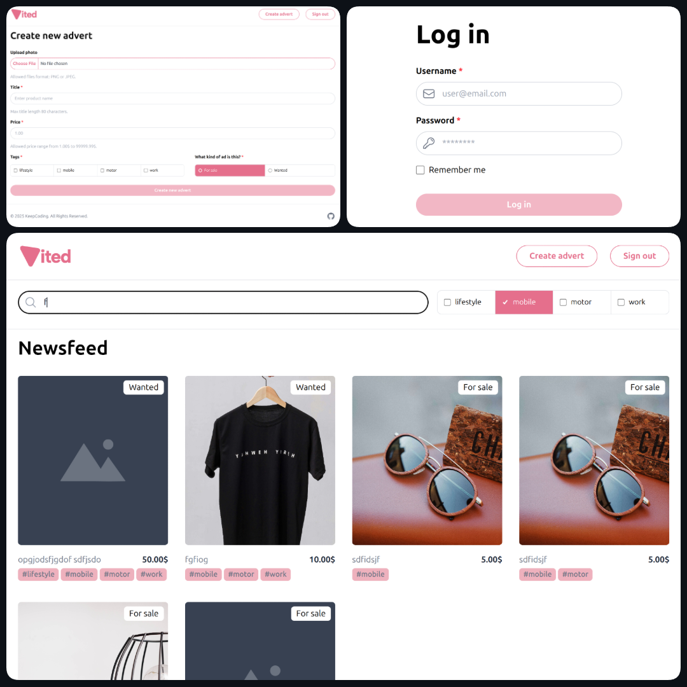

# Proyecto

Proyecto de práctica del módulo _Fundamentos de React_ de **KeepCoding**.

## 📌 Tabla de contenidos

- [Descripción](#descripción)
- [Instalación](#instalación)
- [Uso](#uso)
- [Tecnologías y Prácticas Utilizadas](#tecnologías-utilizadas)
- [Capturas](#capturas)
- [Autor](#autor)

## Descripción

Single Page Application con React + TypeScript y el API [nodepop-api](https://github.com/davidjj76/nodepop-api), para servicios de compra y venta de artículos de segunda mano.

## Instalación

Para instalar el proyecto en tu máquina, sigue los siguientes pasos:

1. Clona el repositorio de nodepop-api e inicia el proyecto:

   ```bash
   git clone https://github.com/davidjj76/nodepop-api.git
   cd nodepop-api
   npm install
   npm start
   ```

2. Clona el repositorio del proyecto e inicia el entorno de desarrollo:

   ```bash
   git clone https://github.com/miguelferlez/keepcoding-practica-react.git
   cd keepcoding-practica-react
   npm install
   npm run dev
   ```

## Uso

### Backend

Endpoints de [nodepop-api](https://github.com/davidjj76/nodepop-api) disponibles en `http://localhost:3001/swagger/` :

- `api/auth/signup`
  - POST: Nos permite crear usuarios.
- `/api/auth/me`
  - `GET`: Nos devuelve la información del usuario autenticado
- `/api/auth/login`
  - `POST`: Devuelve un token de acceso cuando le pasamos un email y password de un usuario correctos.
- `/api/v1/adverts`
  - `GET`: Devuelve un listado de anuncios, con la posiblidad de aplicar filtros con la query que enviemos en la URL. Los filtros posibles son:
    - `name=coche` (que el nombre empiece por “coche”, sin importar
      MAY/MIN).
    - `sale=true/false` (si el anuncio es de compra o venta).
    - `price=0-25000` (precio dentro del rango indicado).
    - `tags=motor,work` (que tenga todos los tags)
  - `POST`: Crea un anuncio.
- `/api/v1/adverts/tags`
  - `GET`: Devuelve el listado de tags disponibles.
- /api/v1/adverts/:id
  - `GET`: Devuelve un único anuncio por Id.
  - `DELETE`: Borra un anuncio por Id.

Todos los endpoints bajo /adverts requieren que se envíe el token
proporcionado en el endpoint de login. Se ha de enviar en la cabecera de la petición
de la siguiente forma:

```js
Header[‘Authorization’] = `Bearer ${token}`
```

### Frontend

Rutas de la aplicación:

**Públicas**: Accesibles para cualquier usuario.

- `/login`: LoginPage

**Protegidas**: Accesibles SOLO para usuarios autenticados. Cualquier acceso de un usuario no autenticado a cualquiera de estas rutas redireccionará a `/login`.

- `/`: Redirecciona a `/adverts`
- `/adverts`: AdvertsPage
- `/adverts/:id`: AdvertPage
- `/adverts/new`: NewAdvertPage

Cualquier URL que no coincida lleva a NotFoundPage.

## Tecnologías y Prácticas Utilizadas

- Bun
  - Axios
  - CLSX
  - React DOM
  - React Router
  - Zod
- ESLint
- Prettier
- React
  - Error boundary
  - Prop drilling
  - Lazy loading
  - useState, useEffect y useRef
- TailwindCSS
- TypeScript
- Vite

## Capturas

</img>

## Autor

Miguel Fernández @miguelferlez
